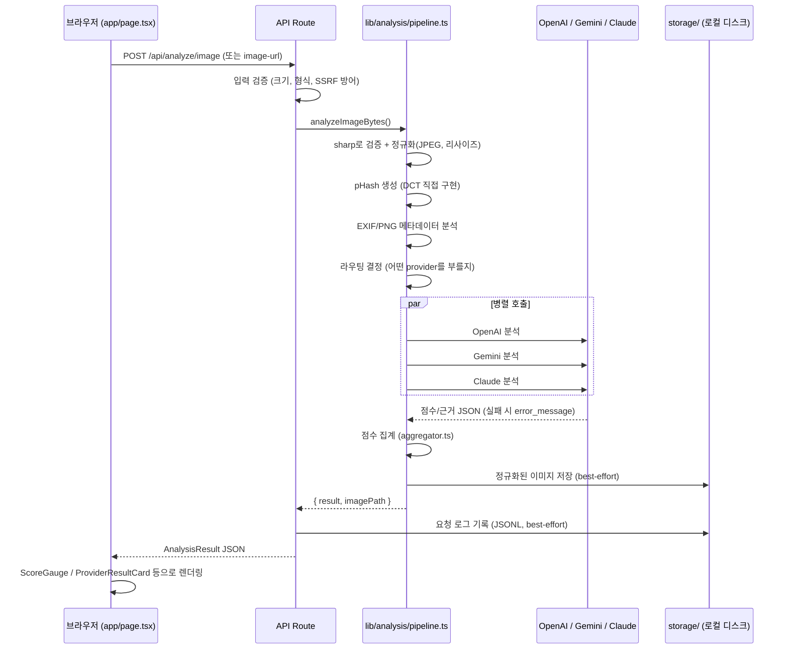

# Imalytix Next.js — 코드 리뷰 가이드

이 문서는 이 코드를 처음 보는 사람이 "어디서부터 읽어야 하는지, 왜 이렇게 짜여 있는지"를 빠르게 파악하도록 돕기 위한 문서입니다. API 명세나 개발 계획은 [`PLAN.md`](../PLAN.md)를 참고하세요.

## 1. 이 프로젝트가 하는 일

이미지(파일 업로드 또는 URL)를 받아서 **AI 생성 이미지인지 실제 촬영 사진인지**를 판별합니다. 판별 근거는 두 가지입니다.

1. **메타데이터** — EXIF/PNG에 남은 생성 도구 흔적 (Stable Diffusion, ComfyUI 등)
2. **비전 LLM 3종 앙상블** — GPT-4o, Gemini 2.5-flash, Claude Haiku에게 각기 다른 관점(해부학/물리, 텍스처/노이즈, 일관성/맥락)으로 이미지를 분석시키고 점수를 종합

백엔드/프론트엔드가 분리된 예전 구조(FastAPI + Vite)와 달리, **이 프로젝트는 Next.js 하나로 프론트엔드와 백엔드(API Route)를 모두 포함하는 단일 스택**입니다. 외부 백엔드를 호출하지 않으며, 외부로 나가는 요청은 OpenAI/Gemini/Anthropic API 호출과 "URL로 분석하기" 기능에서 사용자가 지정한 이미지 URL을 받아오는 것 두 가지뿐입니다.

## 2. 요청 처리 흐름



핵심: **한 프로바이더가 실패해도 전체 요청은 실패하지 않습니다.** 각 vision 클라이언트는 예외를 밖으로 던지지 않고 `error_message`가 채워진 결과 객체를 반환하도록 설계되어 있습니다 ([`lib/vision/normalize.ts`](../lib/vision/normalize.ts)).

## 3. 디렉터리 구조와 책임

```
app/
├── page.tsx                     # 유일한 페이지. 업로드 UI + 결과 렌더링 (client component)
├── layout.tsx, globals.css      # 루트 레이아웃, 폰트, Tailwind
├── icon.png                     # 파비콘 (Next.js 파일 기반 컨벤션)
└── api/
    ├── analyze/image/route.ts       # multipart 업로드 분석
    ├── analyze/image-url/route.ts   # URL 분석 (SSRF 가드 거침)
    └── health/route.ts              # 헬스체크 (각 API 키 설정 여부)

lib/
├── analysis/
│   ├── pipeline.ts       # 전체 분석 파이프라인의 오케스트레이터 (여기서 시작해서 읽으면 전체 흐름 파악됨)
│   ├── metadata.ts       # EXIF(exifr) + PNG tEXt/iTXt 청크 직접 파싱, AI 도구 키워드 매칭
│   ├── phash.ts          # 지각 해시(pHash) — imagehash.phash와 동일한 DCT 알고리즘 수동 구현
│   ├── router.ts         # quick 모드에서 비전 호출을 건너뛸지 결정하는 정책
│   └── aggregator.ts     # 메타데이터 점수 + 비전 점수(가중평균) + 합의 보너스 → 최종 0~100점
├── vision/
│   ├── prompts.ts        # 3개 프로바이더 프롬프트 원문 + 이미지 유형(사진/일러스트/픽셀아트) 판별
│   ├── openai.ts / gemini.ts / anthropic.ts   # 프로바이더별 SDK 호출 + 에러 처리
│   ├── normalize.ts      # 모델 응답(자유 텍스트/JSON)을 VisionResult 타입으로 정규화
│   └── errorMessage.ts   # SDK 에러를 "인증 실패/rate limit/timeout/네트워크" 등으로 분류해 한국어 메시지 생성
├── image/preprocess.ts   # sharp로 EXIF 방향 보정 + 리사이즈 + JPEG 재인코딩 (비전 모델엔 항상 이 결과가 전달됨)
├── net/safeFetch.ts      # "URL로 분석" 기능의 SSRF 방어 (사설 IP 차단, 리다이렉트 제한, 크기 제한)
├── storage/imageStore.ts # 분석된 이미지를 로컬 디스크에 저장 (best-effort, 실패해도 분석 자체는 안 막음)
├── logging/analysisLogger.ts  # 요청 단위 감사 로그 (JSON Lines)
└── utils/score.ts        # 0~1 점수 ↔ 0~100 퍼센트 변환, 라벨/색상 헬퍼

components/
├── layout/AppHeader.tsx
├── upload/{ImageUploader,SelectedImagePreview}.tsx
└── results/{ProviderResultCard,MetadataResultCard,RecommendationPanel,ScoreGauge,AnalysisStepsLoader,ErrorState}.tsx

types/analysis.ts   # 서버-클라이언트 공유 타입. API 응답 스키마의 단일 진실 공급원(source of truth)
```

**읽는 순서 추천**: `types/analysis.ts` → `lib/analysis/pipeline.ts` → `lib/analysis/aggregator.ts` → `app/page.tsx`. 이 4개 파일만 봐도 시스템 전체가 이해됩니다. 나머지는 각 단계의 세부 구현체입니다.

## 4. 핵심 설계 결정과 이유

| 결정 | 이유 |
|---|---|
| pHash를 라이브러리 없이 직접 구현 | npm에 Python `imagehash.phash`와 동일한 32×32 DCT 알고리즘을 제공하는 검증된 패키지가 마땅치 않아서, 알고리즘을 그대로 이식(`lib/analysis/phash.ts`). 상수 배율 차이는 median 임계값 비교라 순서에 영향 없음을 확인하고 생략함. |
| 비전 모델 호출은 절대 예외를 던지지 않음 | 3개 중 1~2개가 실패해도(rate limit, 콘텐츠 정책 거절 등) 나머지 결과로 서비스가 계속 동작해야 하기 때문. `normalizeModelResult`가 항상 유효한 `VisionResult`를 반환. |
| `lib/net/safeFetch.ts`로 SSRF 방어 | "URL로 분석" 기능은 서버가 사용자 지정 URL을 대신 fetch하는 기능이라, 그대로 두면 내부망(`169.254.169.254` 등 클라우드 메타데이터 엔드포인트 포함)을 스캔하는 데 악용될 수 있음. DNS 조회 결과와 리다이렉트마다 사설/루프백 IP를 재검증. |
| 이미지 저장/로깅이 로컬 파일 기반 (`storage/`) | 현재는 로컬 실행 전제. DB(Turso) 없이도 바로 쓸 수 있는 최소 구현. `storage/`는 `.gitignore`에 포함되어 있어 실제로 커밋되지 않음. |
| `storage/` 기반 저장은 서버리스(Vercel)에서 그대로 못 씀 | Vercel 함수의 파일시스템은 요청 간 유지되지 않음(에페메럴). 배포 시엔 `lib/storage/imageStore.ts`의 `saveAnalyzedImage()` 시그니처를 유지한 채 내부 구현만 오브젝트 스토리지(S3/R2/Vercel Blob)로 교체하면 되도록 그 함수 하나 뒤에 구현을 숨겨둠(seam). |
| 프론트엔드가 API 응답 타입을 그대로 신뢰 | `types/analysis.ts`가 서버·클라이언트 공유 타입이라 런타임 스키마 검증(zod 등)이 없음. 신뢰 경계는 "LLM이 내놓은 JSON을 파싱하는 지점"(`lib/vision/normalize.ts`)이며, 거기서만 방어적으로 값을 정규화/클램프함. |

## 5. 새 기능을 추가하려면

- **비전 프로바이더 추가**: `lib/vision/`에 새 클라이언트 작성 → `normalizeModelResult` 재사용 → `lib/analysis/pipeline.ts`의 `routing.call_*` 분기와 `providerCalls` 배열에 추가 → `lib/analysis/router.ts`의 `hasKeys`에 반영.
- **점수 산식 조정**: `lib/analysis/aggregator.ts` 하나만 수정하면 됨. 가중치 상수(`CONFIDENCE_WEIGHTS`, `VISUAL_EVIDENCE_POINTS`, `FINAL_LABELS`)가 파일 상단에 모여 있음.
- **프롬프트 수정**: `lib/vision/prompts.ts`. 프로바이더별 프롬프트가 분리돼 있어 한 곳만 건드리면 해당 프로바이더 전체에 반영됨.

## 6. 알려진 제약 / TODO

- **DB 없음**: pHash 캐시, 중복 분석 스킵 없음 (PLAN.md Phase 6, Turso 미착수). 매 요청이 항상 비전 모델 3개를 다시 호출함 — 비용/속도에 영향.
- **로컬 파일 스토리지의 한계**: 서버 재시작/재배포 시 유지되지만 여러 인스턴스로 수평 확장하면 인스턴스마다 로그/이미지가 흩어짐. 단일 서버 로컬 실행 전제.
- **속도 제한(rate limiting) 없음**: 누구나 `/api/analyze/image`를 반복 호출해 LLM 비용을 소진시킬 수 있음. 공개 배포 전에 반드시 추가 필요.
- **CORS 설정 없음**: 같은 오리진(브라우저 UI)에서만 호출 가능. 크롬 확장 프로그램 등 다른 오리진에서 붙으려면 API Route에 CORS 헤더 추가 필요.
- **런타임 스키마 검증 없음**: LLM 응답 JSON 파싱은 방어적이지만, 클라이언트→서버 입력(예: `mode` 값)은 최소한의 화이트리스트 체크만 함.

## 7. 리뷰 시 체크리스트

- [ ] `lib/vision/*.ts`를 수정했다면: 예외를 밖으로 던지지 않고 여전히 `normalizeModelResult`를 거쳐 반환하는가?
- [ ] `lib/analysis/pipeline.ts`를 수정했다면: 비전 모델 실패가 전체 요청 실패로 전파되지 않는가?
- [ ] 새 API 입력을 추가했다면: `lib/net/safeFetch.ts` 수준의 신뢰 경계(사용자 입력 검증)가 필요한 지점은 아닌가?
- [ ] `storage/`, `.env.local` 등 gitignore 대상 파일이 실수로 커밋되지 않았는가? (`git status` 확인)
- [ ] UI에서 API 실패 시 사용자에게 원인이 보이는가? (`error_message` 배너 경로를 타는지)
